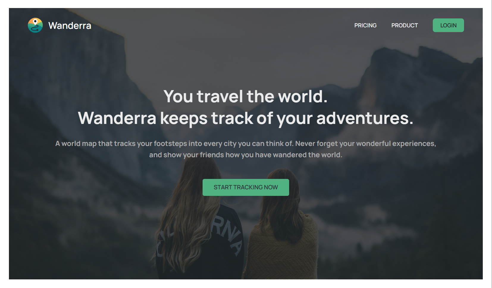
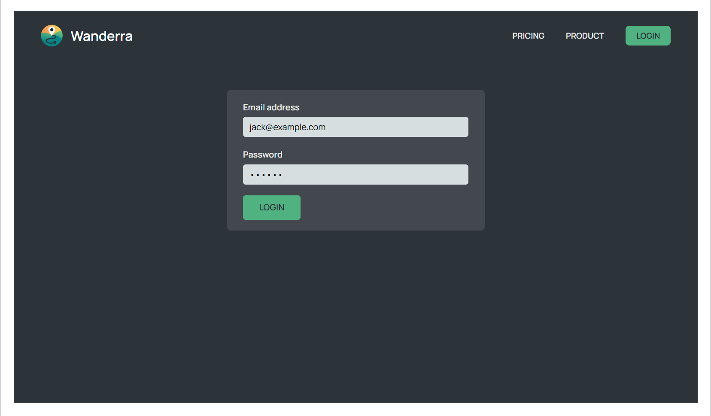
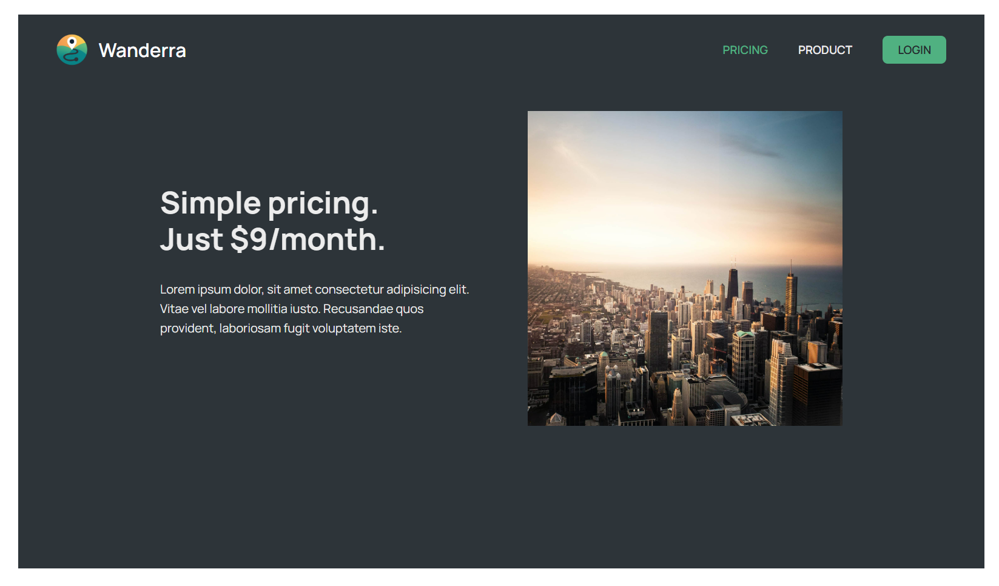
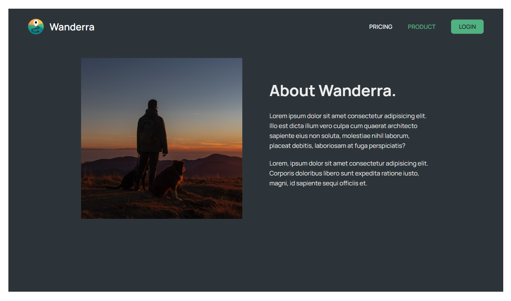
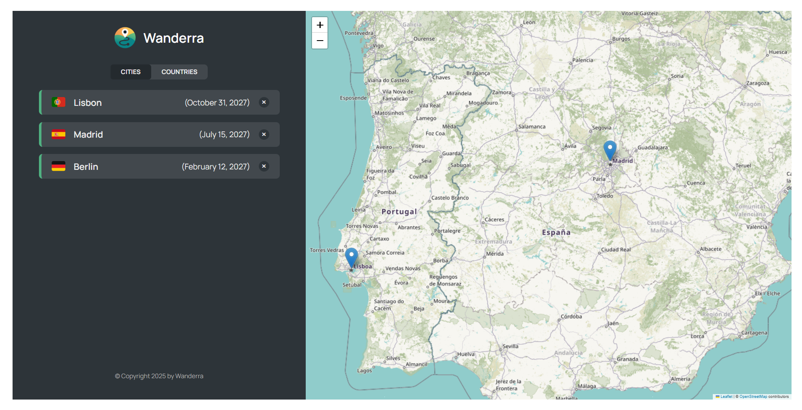
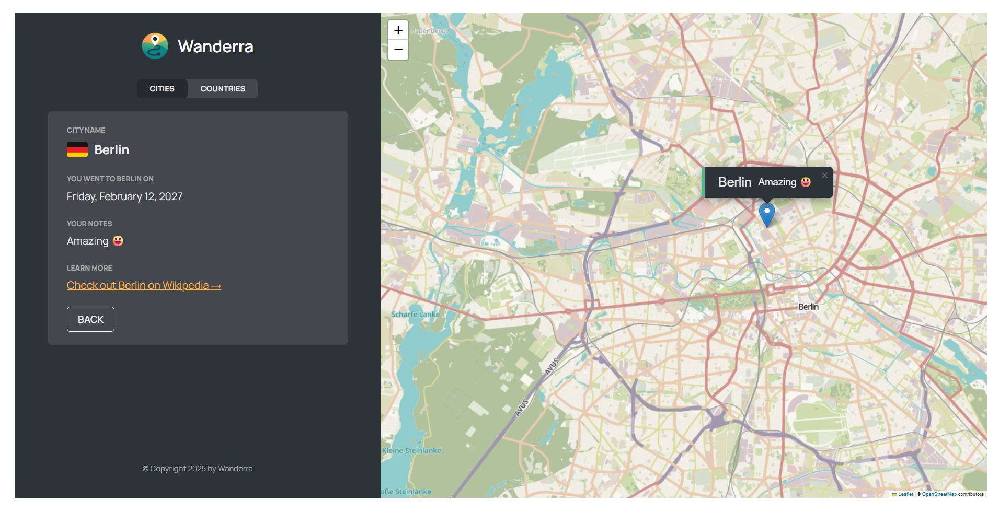
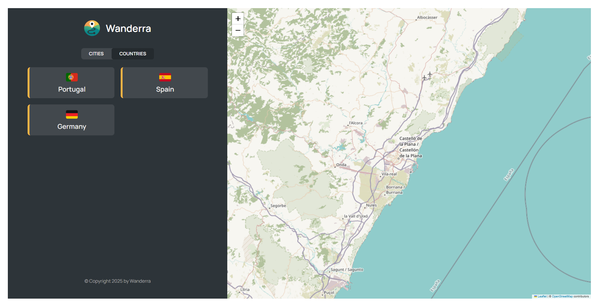
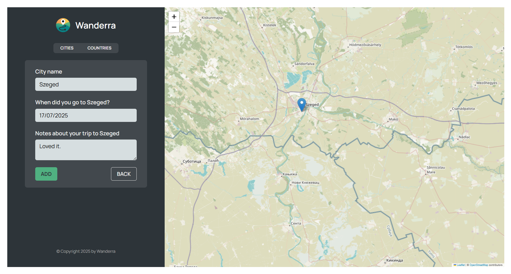

# Wanderra 🌍

**Wanderra** is a travel-focused web application and a **learning** project built with React, designed to explore real-world concepts like routing, map integration, and UI state management.  

This is a **frontend-only project** created for educational purposes.

> ⚠️ **Note:** Authentication is simulated with a **fake login** system. No backend is connected.

---

## ✨ Features

- 🏠 Home page with navigation
- 🔐 **Fake login** for simulated authentication flow (in progress)
- 💳 Product & pricing page
- 🗺️ Interactive map with Leaflet
- 📍 City and country list with detail view (WIP)
- ➕ Form to add new cities (in progress)

---

## 🧠 React Concepts Practiced

- 🔁 **React Router v6** for dynamic routing & nested layouts
- 🧠 **React Context API** for global state (e.g., authentication, city data)
- 🪝 **Custom hooks** to abstract logic (e.g., city data handling, form handling)
- 🐢 **Lazy loading** & code splitting with `React.lazy` and `Suspense`
- 🎯 **Controlled components** in forms
- 💅 **CSS Modules** for scoped styling
- 🗺️ **React Leaflet** for map interactivity
- 🔃 **State lifting** and prop drilling when necessary
- 🚫 **No backend** – all data is handled locally (in-memory / hardcoded)

---

## 🖼️ Screenshots

### Home

---

### Login Page

---

### Pricing Page

---

### Product Page

---

### Interactive Map (Tracking) with Cities List

---

### City Details

---

### Countries List

  

---

### Add New City

---

## 🛠️ Tech Stack

- **React 18**
- **React Router v6**
- **React Leaflet**
- **CSS Modules**
- **Vite**
- **No backend** (pure frontend learning focus)

